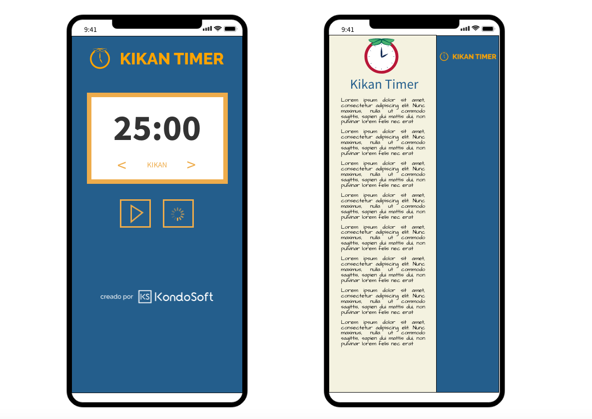
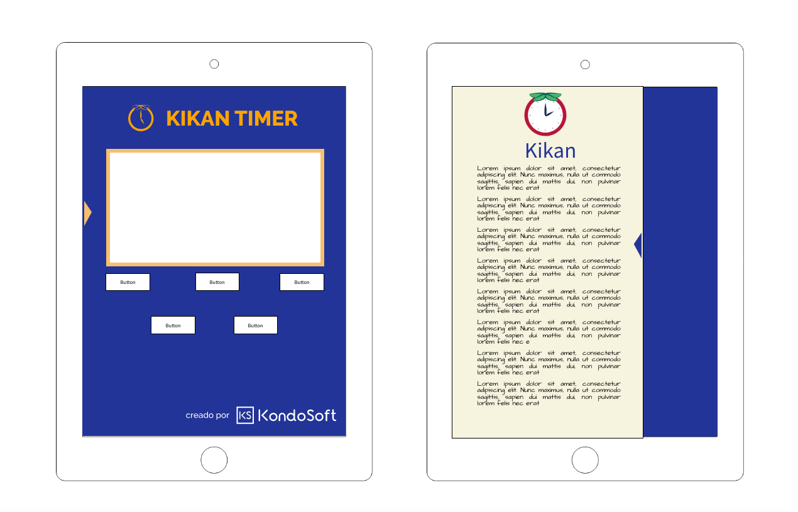
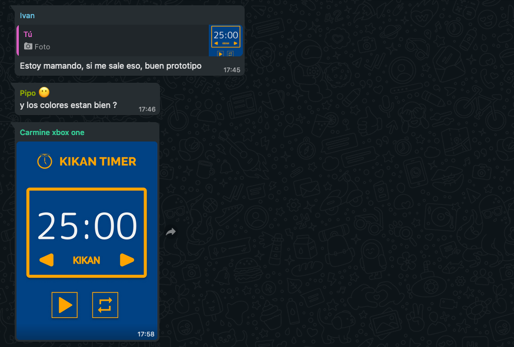

# Kikan

---

# Wireframing 

---

### Kikan

---

##### Mobile

This is the Mobile view.
The buttons are in the center because is more accessible to press for the User.

---

##### Ipad

This is the Ipad view.
The buttons are in the center too, because is more easy for the user to press any one.

---

### Figma Design

---

##### Tablet 

--- 

[figma](https://www.figma.com/proto/cO5Ist0yAXXNP2AGkmJ3Q1/Kikan-Tablet?node-id=15%3A0&scaling=scale-down&page-id=0%3A1)

---

#### Mobile

[figma](https://www.figma.com/proto/oznReD7B0drSij9HmQwBcL/Kikan?node-id=1%3A22&scaling=scale-down&page-id=0%3A1)

---

#### Feedback

---

---

---

---

### VERCEL 

[github](https://kikan-8a94d37y6-pipos.vercel.app/)
